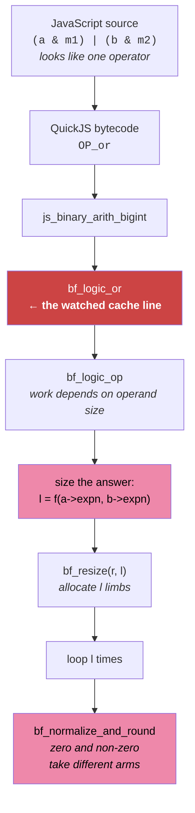
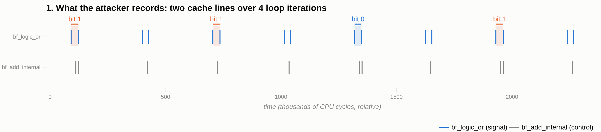
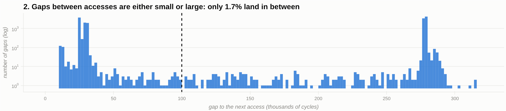
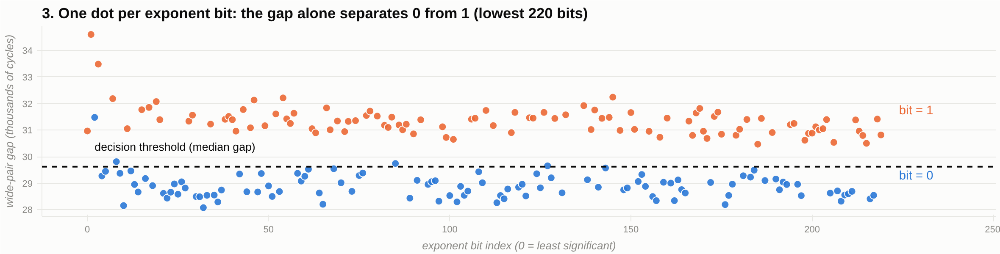
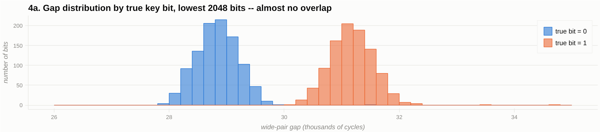
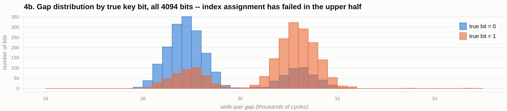
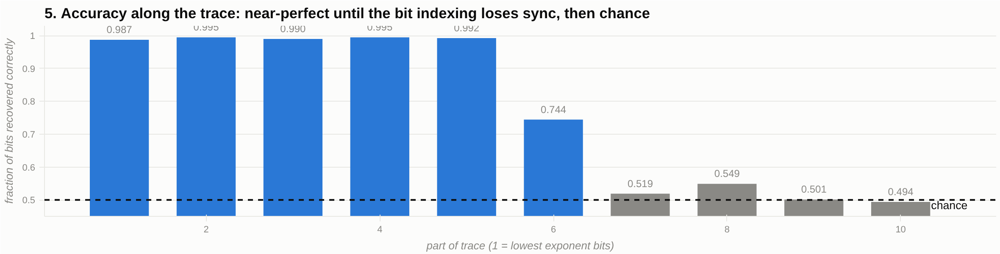

# How this attack works, in plain language

This is a walkthrough of the attack in `REPORT.md` section 5.2 for someone who has
not read the paper. It explains what is being attacked, why the defence that was
supposed to stop it does not, how the measurement is taken, and how the numbers in
the report come out of it. Technical terms are introduced where they are first
needed and nowhere else.

---

## 1. The setting

Two programs run on the same computer at the same time.

- The **victim** is a JavaScript program. It uses the OpenPGP.js library to sign a
  message with an RSA private key. The key is 4096 bits, and the secret part of it
  is a very large number called `d` (the "private exponent"). Anyone who learns `d`
  can forge signatures and decrypt messages. `d` never leaves the victim's memory.
- The **attacker** is a separate program running as an ordinary, unprivileged user.
  It cannot read the victim's memory. It cannot see the victim's variables. It
  cannot even time how long the signature takes as a whole.

What the attacker *can* do is watch a shared resource: the CPU's cache. Both
programs run on the same physical processor, and the processor keeps one shared
pool of fast memory — the last-level cache — for everything running on it. By
watching how that shared pool changes, the attacker can tell *when* the victim
touches a particular piece of code, to within a few hundred processor cycles.

The whole attack is built out of that one ability: a stream of timestamps saying
"the victim just ran this bit of code, and now again, and now again."

## 2. What the victim is doing

RSA signing boils down to raising a number to the power `d`. You cannot do that by
multiplying `d` times — `d` is a 4094-bit number, so that would take longer than the
age of the universe. Instead the code uses **square-and-multiply**, which walks
through the bits of `d` one at a time, from the last bit to the first:

```
for each bit of d, from lowest to highest:
    rx = r * x          (a candidate result, only useful if this bit is 1)
    r  = <bit is 1 ? rx : r>     (keep it, or throw it away)
    x  = x * x          (prepare for the next bit)
```

There are about 4094 iterations, one per bit of the secret. The only thing that
differs between a `0` bit and a `1` bit is that one line in the middle: whether the
freshly computed `rx` is kept or discarded.

That single line is the entire leak. If the attacker can tell, for each of the 4094
iterations, whether the value was kept or discarded, they have read out `d` bit by
bit.

## 3. The original leak, and the fix that was proposed

Originally that line was written as a plain conditional:

```js
r = lsb ? rx : r;
```

A JavaScript engine compiles that into a **branch**: a jump instruction that goes one
way when the bit is 1 and another way when the bit is 0. Different code runs in the
two cases, so different code gets loaded into the cache, and an attacker watching the
right cache line sees the difference directly. That is the attack in section 5.1 of
the report, and it works well.

The OpenPGP.js maintainers proposed a fix that removes the branch entirely. Instead
of choosing with an `if`, you compute *both* answers and mask one of them away with
arithmetic:

```js
function SELECT(cond, a, b, maxBitLength) {
  const mask = 1n << maxBitLength;              // 2^4096
  return (a & (mask - cond)) | (b & (mask - 1n + cond));
}
```

The trick: `mask - 1n` is a 4096-bit number with every bit set to 1, and ANDing
anything with it leaves that thing unchanged. `mask` on its own is a 1 followed by
4096 zeros, and ANDing a smaller number with it always gives zero. So:

- if `cond` is 1: the first AND gives back `a`, the second gives 0, the OR gives `a`.
- if `cond` is 0: the first AND gives 0, the second gives back `b`, the OR gives `b`.

Either way, exactly the same operations run in exactly the same order: two
subtractions, one shift, two ANDs, one OR. No jump anywhere tests the secret. Read
as JavaScript source code, this is genuinely constant-time, and it does defeat the
original attack.

## 4. Why the fix does not actually work

The fix is written in JavaScript, but it does not *run* in JavaScript. It runs inside
the engine — here, QuickJS — and in particular inside the engine's big-number
library, which is what actually performs `&` and `|` on 4096-bit values.

A single `|` in the JavaScript source turns into this:



The operator the programmer wrote is at the top. Everything below it is a function
call, and the three shaded boxes are all sensitive to how big the numbers are.

That library is not constant-time, and it was never meant to be. When it ORs or ANDs
two numbers, it first works out how big the answer needs to be, then allocates that
much space, then loops over that many 64-bit chunks. **The amount of work is
proportional to how big the numbers are.**

Now look again at the table above. The *operations* are identical for both values of
the secret bit, but the *values* are not:

- when the bit is 1, the first AND produces a full-size 4096-bit number and the
  second produces zero;
- when the bit is 0, it is the other way round.

Zero is a special case in the library, handled on a different path from a full-size
number. And the OR that follows inherits its size from whichever operand is the big
one.

So the secret bit no longer decides *which instructions run*. It decides *how large
the numbers handed to those instructions are*, and the library spends time in
proportion to size. The branch is gone; the timing difference is not.

### 4.1 The library function, simplified

Here is the actual function that does the work, `bf_logic_op` in QuickJS's
`libbf.c`. Both `&` and `|` on big integers go through it — `bf_logic_or` is a
one-line wrapper that calls it with `op = OR`. Error handling and the negative-number
path are stripped out below; the surviving lines are unchanged. A "limb" is one
64-bit chunk of a big number, and `expn` is, for a non-negative integer, the number
of significant bits it has.

```c
static int bf_logic_op(bf_t *r, const bf_t *a, const bf_t *b, int op)
{
    /* ---- 1. How many limbs will the answer need? ---- */
    if (op == BF_LOGIC_AND && r_sign == 0)
        l = bf_min(a->expn, b->expn);   /* AND: bounded by the SMALLER operand */
    else
        l = bf_max(a->expn, b->expn);   /* OR:  bounded by the LARGER  operand */

    l = (bf_max(l, 1) + LIMB_BITS - 1) / LIMB_BITS;   /* bits -> limbs, LIMB_BITS = 64 */

    /* ---- 2. Allocate that many limbs ---- */
    if (bf_resize(r, l))
        goto fail;

    /* ---- 3. Loop over them, one chunk at a time ---- */
    for (i = 0; i < l; i++) {
        v1 = get_bits(a->tab, a->len, a_bit_offset + i * LIMB_BITS);
        v2 = get_bits(b->tab, b->len, b_bit_offset + i * LIMB_BITS);
        r->tab[i] = bf_logic_op1(v1, v2, op);        /* the actual | or & */
    }

    /* ---- 4. Clean up: trim leading zero limbs, renormalise ---- */
    r->expn = l * LIMB_BITS;
    bf_normalize_and_round(r, BF_PREC_INF, BF_RNDZ);
    ...
}
```

The point is that `l` — which controls the allocation in step 2 and the trip count in
step 3 — is computed **from the operands**, not from a fixed width. There is no
constant-time discipline here, and there was never meant to be: this is a general
big-number library, and doing less work on smaller numbers is exactly what it should
do.

Step 4 is worth expanding, because it is where zero and non-zero diverge most:

```c
int bf_normalize_and_round(bf_t *r, limb_t prec1, bf_flags_t flags)
{
    l = r->len;
    while (l > 0 && r->tab[l - 1] == 0)     /* scan down past zero limbs */
        l--;

    if (l == 0) {                            /* the whole value was zero */
        r->expn = BF_EXP_ZERO;
        bf_resize(r, 0);                     /* free the buffer entirely */
    } else {
        shift = clz(r->tab[l - 1]);          /* align so the top bit is 1 */
        if (shift != 0) {
            for (i = 0; i < l; i++)          /* a second pass over l limbs */
                r->tab[i] = (r->tab[i] << shift) | ...;
        }
        __bf_round(r, prec1, flags, l, 0);
    }
    ...
}
```

Now put the two cases side by side. Recall from the table in section 3 that one of the
two ANDs produces a full-size 4096-bit value and the other produces zero, and *which
one* is decided by the secret bit.

|                          | operand is zero                                | operand is a full 4096-bit value              |
|--------------------------|------------------------------------------------|-----------------------------------------------|
| the `while` scan         | walks all 64 limbs, every one of them zero     | stops immediately at the top limb             |
| which arm is taken       | the `l == 0` arm: set exponent, free the buffer | the `else` arm                                |
| the alignment pass       | does not happen                                 | a second loop over all 64 limbs, if a shift is needed |
| the rounding call        | skipped                                         | `__bf_round` runs                             |
| the following OR's `l`   | comes from the *other* operand                  | comes from *this* one                         |

Note that it is not simply "zero is faster". Zero does a longer initial scan and then
almost nothing; non-zero exits the scan instantly and then does more work. The two
paths are just *different*, and different is all the attack needs — it is measuring an
interval, not looking for a known sign.

Three separate quantities therefore depend on the secret: the number of limbs
allocated, the trip count of the main loop, and the work done by the cleanup pass.

One thing the report is careful about, and worth repeating: **the two ANDs run the same
number of iterations either way.** For AND, `l` is taken from the *smaller* operand, and
the mask is always at least as large as `a` or `b`, so `l` ends up equal to the bit
length of `a` (or of `b`) no matter what `cond` is. The trip count of the AND loop is
*not* the leak. The leak is which AND *returns* zero, and what that does to step 4 and
to the OR that follows.

This is the general lesson of the report: **in a managed language like JavaScript, a
bitwise operator is not a machine instruction. It is a function call whose cost grows
with the size of its arguments.** Making the source code branch-free does nothing
about that.

## 5. What the attacker measures

The attacker picks one specific function inside the big-number library, `bf_logic_or`,
and watches the cache line that holds it.

The reason for that choice is that it is *exclusive*: in the patched signing code, the
only place a `|` between two big numbers happens is inside `SELECT` itself. So every
single time that cache line is touched, it is because the victim is executing the line
of code we care about. Nothing else in the program can make it fire.

A second cache line, holding `bf_add_internal`, is watched at the same time as a
**control**. That one is *not* exclusive — it fires constantly from the multiplications
and divisions that happen every iteration regardless of the secret. It should show no
relationship to the key, and if it did, that would mean something was wrong with the
measurement rather than that the key had leaked. (It comes out at correlation 0.036,
which is essentially nothing. Good.)

### Why Prime+Scope and not Flush+Reload

There are two standard ways to watch a cache line, and here the choice matters.

**Flush+Reload** works like checking a mousetrap. You evict the line from the cache,
wait a while, then read it and time the read: fast means the victim touched it while
you waited, slow means it did not. The problem is that you only see *whether* an access
happened during the wait, not how many or exactly when — and shortening the wait to
sample faster also shrinks the window you can see, so you gain almost nothing. Measured
here, pushing the wait down from 2000 to 100 cycles sped the probe up 2.1× but cut
detected accesses by 3.2×. At its very fastest it records 2 to 3 accesses per `SELECT`
call — enough to count roughly how busy the line is, nowhere near enough to measure a
duration *inside* one call.

**Prime+Scope** works more like a tripwire with a stopwatch. Instead of flush, wait,
reload, the attacker sits in a tight loop doing one timed read over and over, and
records a timestamp the instant it notices the victim has evicted it. The loop period
here is 154 cycles, against Flush+Reload's floor of 1778 — more than ten times finer,
and it lifts the record to about 4.1 accesses per call.

The price is that Prime+Scope watches a whole cache *set* rather than a single line, so
any other address that happens to land in that set is counted too. That is only
acceptable because the target was chosen to be exclusive in the first place.

The attacker knows exactly where the two target functions live: the victim and the
attacker share the same `libquickjs.so` library file, so its load address plus a fixed
offset gives the address. No searching is needed.

## 6. Turning timestamps into bits

What comes out of the measurement is a long list of timestamps — moments when the
`bf_logic_or` line was touched. Roughly 16,000 of them for one signature (16,809 in
trace r0). The job now is to turn that into 4094 bits.

### The pattern we are looking for

Here is what the attacker actually records. Time runs left to right; each tick is one
detected cache access. The top row is the signal line, the bottom row the control line.
Four loop iterations — four bits of the key — are shown.



The accesses arrive in **pairs**, two pairs per loop iteration. The shaded pair in each
iteration is the one that carries the bit; its width is the measurement. The gap between
the two ticks of a shaded pair is visibly larger where the true bit is 1.

Two facts make this usable:

1. **The gaps come in two wildly different scales**, with almost nothing in between:

   

   Inside a pair the gap is ~25,000–32,000 cycles; between pairs it is ~278,000. Only
   1.7% of gaps fall anywhere in the middle. So the threshold that splits "inside a
   pair" from "between pairs" — the decoder uses 100,000 — can be read off the data
   instead of tuned, which matters because a tuned threshold could manufacture a result.
   (`REPORT.md` describes this valley as completely empty; measured on r0 it is 98.3%
   empty. Same argument, stated more precisely.)
2. **Wide and narrow pairs alternate**, 98.2% of the time in r0. So each loop iteration
   contributes exactly one of each, and the decoder can tell them apart by a simple
   median split.

### The bit itself

Zoom in on the wide pair. Its internal gap is the measurement. Plot one dot per exponent
bit — the gap on the vertical axis, the bit position on the horizontal — and colour each
dot by the *true* value of that key bit:



The colours were not used to draw the picture; they were added afterwards to check it.
The dots sort themselves into two bands with a clean corridor between, and the dashed
line — the median, which is all the decoder knows — lands in that corridor.
**That is the whole attack:** read the gap, compare it against the median, and you have
the bit.

The same data as two histograms, over the lowest 2048 bits:



The two distributions barely touch — over the lowest 2048 bits, a single wide pair out of
~2000 lands on the wrong side of the split, and the gap correlates with the key bit at
+0.842.

The catch is that this clean picture only holds for the first part of the trace. Over
all 4094 bits it degrades badly:



Notice the shape of the failure. The `bit = 1` distribution has grown a *second* lump
sitting exactly on top of the `bit = 0` peak, and vice versa. This is not the signal
fading into noise — it is a fraction of the pairs having been handed the *wrong bit
index*, so a genuinely wide gap gets scored against a bit that was really 0. The
underlying measurement is just as good at the end of the trace as at the start; the
bookkeeping that says which bit it belongs to is what breaks. The index-assignment
problem described below is exactly this.

*(Every figure here is generated from the shipped traces by `analysis/plot_figures.py`
— nothing is drawn freehand. Interactive versions, with pan, zoom and hover, are in
`results/figures_r0.html`; `analysis/figures.py` prints the same content as text if you
would rather not install bokeh.)*

### The first attempt fails, informatively

The obvious approach, and the one that worked for the original branch-based attack, is
to group nearby timestamps into clusters — one cluster per loop iteration — and classify
each cluster by how many accesses it contains. That fails here. As you loosen the
threshold for merging neighbours, the number of clusters goes 16,809 → 8,310 → 8,143 →
19. It never settles at 4094. Forcing it to 4094 gives correlations of 0.036 and 0.009
against the key, which is statistical noise. And averaging ten repeats barely moved it
(0.021 → 0.027), when genuine signal buried in random noise should have improved by about
√10. That is the tell: the method was measuring the *wrong thing*, not a faint version of
the right thing.

But the flat region near 8100 is a clue — that is almost exactly 2 × 4094.

### The structure that is actually there

Looking at the gaps between consecutive accesses instead of at cluster counts shows what
is going on immediately. The accesses arrive in **pairs**:

- two accesses about 25,000–32,000 cycles apart,
- then a gap of roughly 278,000 cycles,
- then the next pair.

Nothing in any trace falls between 35,000 and 270,000 cycles. There is a clean empty
valley between the two scales, so the threshold that separates "inside a pair" from
"between pairs" (100,000 cycles) is read straight off the data rather than tuned to make
the answer come out right. That matters: a tuned threshold could manufacture a result.

Sort the pairs by their internal gap and two groups fall out:

| group  | internal gap   | how much it varies |
|--------|----------------|--------------------|
| wide   | 30,050 cycles  | ± 1,400            |
| narrow | 25,650 cycles  | ± 600              |

And consecutive pairs alternate between the two groups 97.5%–98.2% of the time. So each
loop iteration produces two pairs, one wide and one narrow — 2 pairs × 306,000 cycles
matches the measured loop period of about 612,000 cycles, which is confirmed independently
by the fit described below.

**The wide group carries the signal.** Its internal gap varies two to three times as much
as the narrow group's, and that variation is the key bit showing through: a wide-pair gap
above the median means bit 1, below means bit 0.

**The narrow group is a third control.** Same function, same call structure, half the
spread, and no relationship to the key at all. Its existence is evidence that the wide
group's variation is a real effect and not a measurement artefact that would affect
everything equally.

### The decoding procedure

1. Keep only the dense part of the trace, where signing is actually happening. (The probe
   runs for a fixed budget, so the tail is idle time.)
2. Split the accesses into pairs wherever the gap exceeds 100,000 cycles.
3. Keep pairs that contain exactly two accesses; discard the rest.
4. Call a pair *wide* if its internal gap is above the median gap.
5. Assign each wide pair an exponent-bit index (see below — this is the hard part).
6. Report bit 1 if that pair's gap is above the median of the wide group, else bit 0.
7. Reverse the order: square-and-multiply eats `d` from its lowest bit upward, so the
   trace runs backwards relative to how `d` is written down.

Step 7 gives a fourth control for free. If you score in the *forward* order instead, you
should get pure chance. You do: 0.487–0.490 accuracy in every trace, correlations around
−0.02. If the forward order had also scored well, the "signal" would have been an artefact
of the scoring, not the key.

### The hard part: which bit is which

About 100 of the 4094 iterations do not produce a clean two-access pair — they get dropped
at step 3. So the wide group holds roughly 3990 entries for 4094 bit positions, and you
cannot simply match them up by counting.

The naive fix — count forward from the previous pair — fails completely. One missed
iteration shifts *every subsequent bit by one*, which destroys everything after it.
Correlation drops to 0.02, i.e. nothing.

What is used instead: fit a straight line, `timestamp = bit_index × period + offset`, by
least squares across the whole trace, three times over, discarding any index claimed by
more than one pair. Anchoring the fit within 640 smaller blocks instead reaches 0.717;
the single global fit does better still.

**This step is what limits the attack.** Individual pairs sit up to a quarter of a loop
period off the fitted line, so as the trace goes on, the index assignments slide out of
alignment and eventually go wrong.

## 7. What comes out

One RSA-4096 key, five separate signatures, each recorded independently:

| trace | wide pairs | alternation | correlation with key | bits assigned | accuracy | forward-order control |
|-------|-----------:|------------:|---------------------:|--------------:|---------:|----------------------:|
| r0    | 4023 | 0.982 | **+0.4994** | 3989 | 0.7766 | −0.0182 (0.4896) |
| r1    | 3988 | 0.979 | +0.4242 | 3967 | 0.7373 | −0.0171 (0.4878) |
| r2    | 3987 | 0.975 | +0.0746 | 3960 | 0.5566 | −0.0192 (0.4869) |
| r3    | 4008 | 0.977 | **+0.5151** | 3967 | 0.7751 | −0.0305 (0.4895) |
| r4    | 4024 | 0.979 | +0.0417 | 3988 | 0.5238 | −0.0140 (0.4902) |

A correlation of 0.42–0.52 is 27 to 33 times the noise floor (1/√4094 = 0.0156), so on the
good traces this is not close to a coincidence.

But the overall accuracy of 0.78 badly *understates* the leak, because accuracy is not
uniform along the trace. Splitting each trace into ten consecutive parts:

```
r0:  +0.938 +0.685 +0.864 +0.897 +0.959 +0.478 +0.049 +0.118 +0.003 −0.025
r3:  +0.857 +0.875 +0.936 +0.901 +0.949 +0.461 +0.049 +0.082 −0.006 −0.002
```

Drawn out, with the corresponding per-part accuracy for r0 (recomputed from the
shipped trace):



The first half is at +0.94 to +0.96 and 99% accurate — nearly perfect. Then the index
assignment loses synchronisation and the rest is indistinguishable from chance. It is
one failure, at one point, not gradual degradation — which is why the fix (accounting
for missing iterations) would be worth much more than better measurement hardware.

Because the trace is read backwards, the *first* half of the trace corresponds to the
*lowest* bits of `d`. So:

| lowest N bits | 256 | 1024 | 2048 | all 4094 |
|---------------|----:|-----:|-----:|---------:|
| r0 | 0.979 | 0.993 | 0.992 (1995 assigned) | 0.777 (3989) |
| r1 | 0.980 | 0.992 | 0.967 (1972) | 0.737 (3967) |
| r3 | 0.972 | 0.985 | 0.989 (1985) | 0.775 (3967) |

**Trace r0 recovers 1995 of the lowest 2048 bits of the private exponent with 16 errors,
from a single signature.**

That is enough. Known results on partial key exposure recover a full RSA key from the
lowest quarter of the private exponent when the public exponent is small; here we have
half of it. The report cites that bound rather than running the lattice computation, so
the final step from "half the exponent" to "the key" is established in the literature but
not demonstrated in this artifact.

One more detail worth understanding: **taking more traces does not help.**

| traces combined | 1 | 2 | 3 | 4 | 5 |
|---|---:|---:|---:|---:|---:|
| accuracy | 0.7766 | 0.7786 | 0.7777 | 0.7596 | 0.7338 |

Normally, averaging independent noisy measurements improves the answer. It does not here,
and eventually it makes things worse. The reason is that the remaining errors are *the same
errors every time*, not independent ones: each trace produces almost the same fitted loop
period, so each one loses synchronisation at almost the same place and gets the same later
bits wrong. Two traces agree with each other on 97.5%–100% of bits *even in the regions
where each is only 50% accurate* — they are confidently wrong together. Averaging cannot
remove a shared mistake. Repetition would start to help only once the index assignment
handles missing iterations properly, and the data needed to do that is present in the
traces: a missing iteration shows up as a gap of roughly twice the loop period.

## 8. Honest limits

- One key, five signatures. Two of the five (r2, r4) are near chance overall. r2 reaches
  +0.653 in its first tenth before desynchronising; r4 has no explanation.
- It is not known which of `SELECT`'s three calls into the big-number logic produces each
  of the ~4.1 recorded accesses per call. The attack works without knowing, but the mapping
  is unestablished.
- The final lattice step to full key recovery is cited, not performed.
- Path B (collecting new traces) needs an Intel CPU with an inclusive last-level cache,
  pinned frequency, disabled address randomisation, and a QuickJS build shared between
  victim and attacker. The two hardcoded byte offsets into `libquickjs.so` are valid only
  for the exact build used here; wrong offsets produce structureless traces rather than an
  error message.

## 9. The one-paragraph version

OpenPGP.js's RSA signing leaked the private key through a conditional branch. The proposed
fix removes the branch by computing both outcomes and masking one away with bitwise AND and
OR, which is branch-free as JavaScript source. But JavaScript's `&` and `|` on 4096-bit
numbers are function calls into the engine's big-number library, and that library does work
proportional to the size of its operands. The secret bit still decides which operand is
full-size and which is zero, so it still decides how long the operation takes. An attacker
sharing the machine watches one cache line inside that library with Prime+Scope, sees the
accesses arrive in pairs, and reads each key bit off the width of the gap inside one pair
per loop iteration. One signature yields 1995 of the lowest 2048 bits of the private
exponent with 16 errors — enough for full key recovery by known lattice methods.
