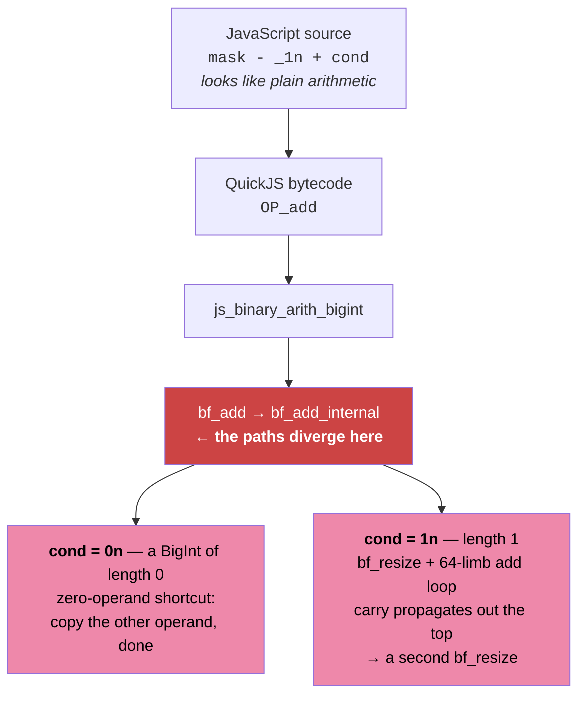

# How this attack works, in plain language

This is a walkthrough of the attack in `REPORT.md` section 5.2 for someone who has
not read the paper. It explains what is being attacked, why the defence that was
supposed to stop it does not, how the measurement is taken, and how the numbers in
the report come out of it. Technical terms are introduced where they are first
needed and nowhere else.

---

## 1. The setting

Two programs run on the same computer at the same time.

- The **victim** is a JavaScript program. It uses the OpenPGP.js library to sign a
  message with an RSA private key. The key is 4096 bits, and the secret part of it
  is a very large number called `d` (the "private exponent"). Anyone who learns `d`
  can forge signatures and decrypt messages. `d` never leaves the victim's memory.
- The **attacker** is a separate program running as an ordinary, unprivileged user.
  It cannot read the victim's memory. It cannot see the victim's variables. It
  cannot even time how long the signature takes as a whole.

What the attacker *can* do is watch a shared resource: the CPU's cache. Both
programs run on the same physical processor, and the processor keeps one shared
pool of fast memory — the last-level cache — for everything running on it. By
watching how that shared pool changes, the attacker can tell *when* the victim
touches a particular piece of code, to within a few hundred processor cycles.

The whole attack is built out of that one ability: a stream of timestamps saying
"the victim just ran this bit of code, and now again, and now again."

## 2. What the victim is doing

RSA signing boils down to raising a number to the power `d`. You cannot do that by
multiplying `d` times — `d` is a 4094-bit number, so that would take longer than the
age of the universe. Instead the code uses **square-and-multiply**, which walks
through the bits of `d` one at a time, from the last bit to the first:

```
for each bit of d, from lowest to highest:
    rx = r * x          (a candidate result, only useful if this bit is 1)
    r  = <bit is 1 ? rx : r>     (keep it, or throw it away)
    x  = x * x          (prepare for the next bit)
```

There are about 4094 iterations, one per bit of the secret. The only thing that
differs between a `0` bit and a `1` bit is that one line in the middle: whether the
freshly computed `rx` is kept or discarded.

That single line is the entire leak. If the attacker can tell, for each of the 4094
iterations, whether the value was kept or discarded, they have read out `d` bit by
bit.

## 3. The original leak, and the fix that was proposed

Originally that line was written as a plain conditional:

```js
r = lsb ? rx : r;
```

A JavaScript engine compiles that into a **branch**: a jump instruction that goes one
way when the bit is 1 and another way when the bit is 0. Different code runs in the
two cases, so different code gets loaded into the cache, and an attacker watching the
right cache line sees the difference directly. That is the attack in section 5.1 of
the report, and it works well.

The OpenPGP.js maintainers proposed a fix that removes the branch entirely. Instead
of choosing with an `if`, you compute *both* answers and mask one of them away with
arithmetic:

```js
function SELECT(cond, a, b, maxBitLength) {
  const mask = 1n << maxBitLength;              // 2^4096
  return (a & (mask - cond)) | (b & (mask - 1n + cond));
}
```

The trick: `mask - 1n` is a 4096-bit number with every bit set to 1, and ANDing
anything with it leaves that thing unchanged. `mask` on its own is a 1 followed by
4096 zeros, and ANDing a smaller number with it always gives zero. So:

- if `cond` is 1: the first AND gives back `a`, the second gives 0, the OR gives `a`.
- if `cond` is 0: the first AND gives 0, the second gives back `b`, the OR gives `b`.

Either way, exactly the same operations run in exactly the same order: one shift, two
subtractions, one addition, two ANDs, one OR. No jump anywhere tests the secret. Read
as JavaScript source code, this is genuinely constant-time, and it does defeat the
original attack.

Keep an eye on that addition. It is the least interesting-looking operation in the
expression — `mask - 1n + cond`, adjusting a mask by one — and it is where the whole
thing comes apart.

## 4. Why the fix does not actually work

The fix is written in JavaScript, but it does not *run* in JavaScript. It runs inside
the engine — here, QuickJS — and in particular inside the engine's big-number
library (`libbf`), which is what actually performs arithmetic on 4096-bit values.

Every operator in `SELECT` — not just the `&` and `|` the fix is built around, but the
`<<`, the two `-`, and the `+` — is a call into that library, and the library is not
constant-time. It was never meant to be: it is a general big-number library, and doing
less work on smaller numbers is exactly what such a library should do.

So the question is not *whether* something in `SELECT` leaks, but *what*. That can be
measured directly: run `SELECT` on an instrumented QuickJS that timestamps each
bytecode handler, with `cond` alternating between `0n` and `1n` and everything else
held fixed (`openpgp_patch/run_opcode_timing.sh`, ten runs at the victim's real
`maxBitLength` of 4096). Median cycles per handler, `cond=1` minus `cond=0`:

| handler | source | `cond=0` | `cond=1` | delta | across 10 runs |
|---|---|---:|---:|---:|---|
| `add` | `mask - _1n + cond` | 612 | 2,034 | **+1,422** | +1,422 … +1,440 |
| `sub` | `mask - cond`, `mask - _1n` | 1,218 | 1,260 | +42 | +34 … +159 |
| `and` | both `&` | 1,272 | 1,288 | +16 | +16 … +33 |
| `or` | the `\|` | 1,128 | 1,092 | −36 | −170 … −30 |
| `shl` | `_1n << maxBitLength` | 348 | 346 | −2 | −2 … 0 |
| | **whole `SELECT`** | | | **≈ +1,450** | +1,367 … +1,581 |

The answer is unambiguous and was not what anyone was looking for. **The `&` and `|`
operations the patch is built around contribute essentially nothing. Almost the entire
bit-dependence is one addition — `+ cond` — in the construction of the second mask.**



`cond` is not a machine word here — it is a BigInt, produced by `exp & 1n`, and `0n`
is represented as a big number of **length zero**. Length zero is a special case in
`libbf`'s addition, taken by an explicit `if`. So the "branchless" patch is not
branchless: `+ cond` turns the secret bit into a zero-length test on a BigInt operand,
and that test is a real branch inside the engine.

This is the general lesson of the report, and it applies more sharply than the original
framing suggested: **in a managed language, an arithmetic operator is not a machine
instruction. It is a function call, and it can branch on its arguments even when your
source code does not.** Masking away the `if` you wrote does nothing about the ones the
runtime adds underneath. It is not enough to check that the *operations* are the same
on both paths; every value that touches the secret has to be checked too, including a
value as innocuous-looking as `0n`.

### 4.1 The library function, and where it splits

Here is the branch, `bf_add_internal` in QuickJS's `libbf.c`, at line 908:

```c
} else if (a->len == 0 || b->len == 0) {
    bf_set(r, a);      /* libbf.c:923 — copy the other operand, then done */
    goto renorm;
}                      /* else: bf_resize + a full 64-limb add loop */
```

`cond = 0n` has `len == 0`, so the add takes the shortcut and finishes with a copy.
`cond = 1n` has `len == 1`, so it runs the full path — and because the left operand is
`mask - 1n`, i.e. `2^4096 - 1`, adding 1 propagates a carry out of all 64 limbs and
triggers a *second* `bf_resize` at `libbf.c:1017` to widen the result. That is the
+1,422 cycles.

This is confirmed independently by Intel PT (`openpgp_patch/run_intel_pt.sh`), which
records the instruction path actually taken. It localizes the divergence to a single
branch, `bf_add_internal+0x26a`, which `addr2line` maps to the `if` above. The
divergence is nine true-only and eight false-only instructions, all inside
`bf_add_internal`, and it is byte-identical across captures at 2048, 4095 and 4096 bits
(`openpgp_patch/pt_results_4096/instruction_set_diff.txt`).

### 4.2 What does *not* leak, and why the obvious guess was wrong

An earlier version of this document blamed the `&` and `|` themselves: the argument was
that one AND produces a full-width 4096-bit value and the other produces zero, that zero
and non-zero take different arms of `bf_normalize_and_round`, and that the following OR
inherits its size from the larger operand. All of that is *true* as a description of
`libbf`, and it is why the guess was attractive. It is simply not where the time goes —
the handler table above measures the `and` pair at +16 cycles and the `or` at −36.

Two reasons the effect is smaller than it looks:

- **The AND loop's trip count does not depend on the secret at all.** In `bf_logic_op`,
  the AND path takes `l = bf_min(a->expn, b->expn)` — deliberately, with the comment "no
  need to compute extra zeros for and" — and the real operand is always narrower than the
  mask, so `l` is the operand's bit length either way.
- **Zero is not simply cheaper.** The zero path does a longer scan for the top non-zero
  limb and then almost nothing; the non-zero path exits that scan immediately and then
  does more work. The two costs largely cancel.

The moral is worth keeping: a mechanism that is *plausible* from reading the library
source is not a measured one. The handler timing and the PT capture are what settled
this, and they disagreed with the reading.

### 4.3 One number that is still unexplained

The instrumented total, ≈ +1,450 cycles for the whole of `SELECT`, is smaller than the
≈ +2,200 the Prime+Scope traces show (§6). That ~700-cycle residual is not accounted
for. PT reports which instructions execute, not what they cost, so it cannot close the
gap — but it does bound where the residual can *be*: the two paths are instruction-
identical outside `bf_add_internal`, `bf_normalize_and_round`, `bf_resize` and
`bf_add_limb`, so it is not somewhere else in `SELECT`. The likely source is the
difference between the timing harness (fixed operands, `cond` alternating) and a real
`modExp` (random bits, each result feeding the next multiply); that is not measured
here.

## 5. What the attacker measures

The attacker picks one specific function inside the big-number library, `bf_logic_or`,
and watches the cache line that holds it.

Note what this line is *for*. `bf_logic_or` is not where the leak happens — §4.2 shows
it costs the same either way. It is a **marker**: it is called exactly once per loop
iteration, at the very end of `SELECT`, so seeing it tells the attacker when `SELECT`
finished. Paired with a marker at the start, that brackets `SELECT` and turns its
duration into something measurable from outside. The attacker is timing the `+ cond`
without ever observing it directly.

The `|` itself is exclusive: in the patched signing code, the only place a `|` between
two big numbers happens is inside `SELECT`. The *cache line* is not, and this is worth
being precise about, because it explains a number that used to be unaccounted for. A
cache line is 64 bytes, and in this build `bf_rint` sits 16 bytes before `bf_logic_or`,
on the same line. `bf_rint` is called from the division routine, so every `%` in the
loop touches the line too. Counting the actual calls in one signature: `bf_logic_or`
fires 4,094 times (once per iteration, as expected) and `bf_rint` 13,305 times (~3.25
per iteration). Their sum, 17,399, is what the ~17,000-record traces are made of. So
what the attacker watches is "SELECT's `|`, plus the loop's divisions" — every access
still comes from inside the modExp loop, but not all of them from `SELECT`.

(The two `&` operations inside `SELECT` go to `bf_logic_and`, which lands on the *next*
cache line and in a different cache set, so it is not part of this signal at all. A
separate run that watches that line instead records ~12,500 events, matching its 12,282
calls.)

That one line is all the attacker watches. An earlier version of this attack also
watched `bf_add_internal` as a control — a line that fires constantly from the
multiplications and divisions every iteration performs regardless of the secret, and
so should show no relationship to the key. It doesn't (correlation 0.036), but the
check turned out to be redundant: the forward-order control in §6 tests the same
thing using the real signal, and does it better. Section 6 comes back to this.

### Why Prime+Scope and not Flush+Reload

There are two standard ways to watch a cache line, and here the choice matters.

**Flush+Reload** works like checking a mousetrap. You evict the line from the cache,
wait a while, then read it and time the read: fast means the victim touched it while
you waited, slow means it did not. The problem is that you only see *whether* an access
happened during the wait, not how many or exactly when — and shortening the wait to
sample faster also shrinks the window you can see, so you gain almost nothing. Measured
here, pushing the wait down from 2000 to 100 cycles sped the probe up 2.1× but cut
detected accesses by 3.2×. At its very fastest it records 2 to 3 accesses per `SELECT`
call — enough to count roughly how busy the line is, nowhere near enough to measure a
duration *inside* one call.

**Prime+Scope** works more like a tripwire with a stopwatch. Instead of flush, wait,
reload, the attacker sits in a tight loop doing one timed read over and over, and
records a timestamp the instant it notices the victim has evicted it. The loop period
here is 154 cycles, against Flush+Reload's floor of 1778 — more than ten times finer,
and it lifts the record to about 4.1 accesses per iteration (which, per above, is one
`bf_logic_or` plus about 3.25 `bf_rint`).

The price is that Prime+Scope watches a whole cache *set* rather than a single line, so
any other address that happens to land in that set is counted too — on top of the
`bf_rint` co-residency, which is a property of the line itself and would affect
Flush+Reload equally.

The attacker knows exactly where the target function lives: the victim and the
attacker share the same `libquickjs.so` library file, and `bf_logic_or` is an exported
symbol, so the attacker just takes its address from the linker. No searching is
needed.

## 6. Turning timestamps into bits

What comes out of the measurement is a long list of timestamps — moments when the
watched line was touched. Roughly 16,000 of them for one signature (16,809 in
trace r0) — against 17,399 `bf_logic_or`+`bf_rint` calls actually made, so the probe
catches almost all of them. The job now is to turn that into 4094 bits.

### The pattern we are looking for

Here is what the attacker actually records. Time runs left to right; each tick is one
detected access to the `bf_logic_or` line. Four loop iterations — four bits of the key
— are shown.


The accesses arrive in **pairs**, two pairs per loop iteration. The shaded pair in each
iteration is the one that carries the bit; its width is the measurement. The gap between
the two ticks of a shaded pair is visibly larger where the true bit is 1.

Two facts make this usable:

1. **The gaps come in two wildly different scales**, with almost nothing in between:

   

   Inside a pair the gap is ~25,000–32,000 cycles; between pairs it is ~278,000. Only
   1.7% of gaps fall anywhere in the middle. So the threshold that splits "inside a
   pair" from "between pairs" — the decoder uses 100,000 — can be read off the data
   instead of tuned, which matters because a tuned threshold could manufacture a result.
   (`REPORT.md` describes this valley as completely empty; measured on r0 it is 98.3%
   empty. Same argument, stated more precisely.)
2. **Wide and narrow pairs alternate**, 98.2% of the time in r0. So each loop iteration
   contributes exactly one of each, and the decoder can tell them apart by a simple
   median split.

### What the four ticks in an iteration actually are

Timestamping every `bf_rint`/`bf_logic_and`/`bf_logic_or` call inside the victim (via
an `LD_PRELOAD` shim over the PLT) shows the loop body is exactly the same seven calls
every iteration — the string `a r r a a o` repeats 2,143 times without a single
deviation in the steady state:

| call | source line |
| --- | --- |
| `bf_logic_and` | `const lsb = exp & 1n` |
| `bf_rint` | `exp >>= 1n` (the shift is lowered to a rounded multiply by a power of two) |
| `bf_rint` | the `%` in `rx = (r * x) % n` |
| `bf_logic_and` | `SELECT`'s `a & (mask - cond)` |
| `bf_logic_and` | `SELECT`'s `b & (mask - 1n + cond)` |
| `bf_logic_or` | `SELECT`'s `\|` |
| `bf_rint` | the `%` in `x = (x * x) % n` |

Only four of those seven are on the watched line — the three `bf_rint` and the
`bf_logic_or`; the three `bf_logic_and` are on the next line. Drop them and the
iteration reads:

```
rint(shift) ---- big multiply ---- rint(r*x % n) - SELECT - or ---- big square ---- rint(x*x % n) - shift ops - rint(shift) ...
                    ~278,000                        ~30,000               ~278,000                   ~25,000
```

That is the whole pair structure. The two ~278,000-cycle gaps are the two modular
multiplications, the two pairs are what survives on either side of them, and the two
kinds of pair are:

- **wide pair** — `rint(r*x % n)` → `or`: everything `SELECT` does. Measured with the
  victim's own record of `lsb`, its gap is 29,608 cycles when the bit is 0 and 32,164
  when the bit is 1, and a single threshold separates them 99.3% of the time.
- **narrow pair** — `rint(x*x % n)` → next iteration's `rint(shift)`: the `exp & 1n` and
  `exp >>= 1n` on the exponent. 25,282 vs 25,374 cycles — no usable dependence (58%,
  and that is with the class imbalance doing the work).

The Prime+Scope trace, measured from outside the victim, reproduces all four intervals:
277,590 / 29,620 / 278,664 / 25,564 cycles against the instrumented 277,734 / 30,726 /
278,880 / 25,326, and a loop period of 611,438 against 612,666. Even the ~1,100-cycle
difference between the multiply and the square shows up, so the orientation — which
pair follows which multiplication — is fixed by the measurement, not assumed.

So the decoder's median split is not arbitrary: the wide class *is* the `SELECT` pair,
and it is the only one that leaks.

Narrowing further, the same instrumentation puts the bit-dependent time *between*
`SELECT`'s two `&` calls, at roughly +1,300 cycles. That is exactly where §4 says it
should be: the expression evaluates left to right, so what sits between the two `&`
calls is `mask - _1n + cond`, and the `+ cond` is the leak.

```
sub   mask - cond
&     ---- first &
sub   mask - _1n      \
add   + cond          /  between the two & calls — the +1,422-cycle divergence
&     ---- second &
|     ---- or
```

Take the *absolute* interposed figures with caution: the shim's per-call overhead is
comparable to the interval it is timing here, so it inflates the endpoints of a short
gap. The delta survives that (the overhead is the same on both paths, and +1,300 agrees
with the +1,450 the independent handler timing gives for the whole of `SELECT`), but the
interposer is not the evidence the §4 mechanism rests on — the per-handler timing and the
PT capture are.

### The bit itself

Zoom in on the wide pair. Its internal gap is the measurement. Plot one dot per exponent
bit — the gap on the vertical axis, the bit position on the horizontal — and colour each
dot by the *true* value of that key bit:


The colours were not used to draw the picture; they were added afterwards to check it.
The dots sort themselves into two bands with a clean corridor between, and the dashed
line — the median, which is all the decoder knows — lands in that corridor.
**That is the whole attack:** read the gap, compare it against the median, and you have
the bit.

The same data as two histograms, over the lowest 2048 bits:


The two distributions barely touch — over the lowest 2048 bits, a single wide pair out of
~2000 lands on the wrong side of the split, and the gap correlates with the key bit at
+0.842.

The same separation holds over all 4094 bits:


That it holds at all depends entirely on each gap being filed against the right bit,
which is the hard part of the decoding and is dealt with in §6.

*(Every figure here is generated from the shipped traces by `analysis/plot_figures.py`
— nothing is drawn freehand. Interactive versions, with pan, zoom and hover, are in
`results/figures_r0.html`; `analysis/figures.py` prints the same content as text if you
would rather not install bokeh.)*

### The first attempt fails, informatively

The obvious approach, and the one that worked for the original branch-based attack, is
to group nearby timestamps into clusters — one cluster per loop iteration — and classify
each cluster by how many accesses it contains. That fails here. As you loosen the
threshold for merging neighbours, the number of clusters goes 16,809 → 8,310 → 8,143 →
19. It never settles at 4094. Forcing it to 4094 gives correlations of 0.036 and 0.009
against the key, which is statistical noise. And averaging ten repeats barely moved it
(0.021 → 0.027), when genuine signal buried in random noise should have improved by about
√10. That is the tell: the method was measuring the *wrong thing*, not a faint version of
the right thing.

But the flat region near 8100 is a clue — that is almost exactly 2 × 4094.

### The structure that is actually there

Looking at the gaps between consecutive accesses instead of at cluster counts shows what
is going on immediately. The accesses arrive in **pairs**:

- two accesses about 25,000–32,000 cycles apart,
- then a gap of roughly 278,000 cycles,
- then the next pair.

Nothing in any trace falls between 35,000 and 270,000 cycles. There is a clean empty
valley between the two scales, so the threshold that separates "inside a pair" from
"between pairs" (100,000 cycles) is read straight off the data rather than tuned to make
the answer come out right. That matters: a tuned threshold could manufacture a result.

Sort the pairs by their internal gap and two groups fall out:

| group  | internal gap   | how much it varies |
|--------|----------------|--------------------|
| wide   | 30,050 cycles  | ± 1,400            |
| narrow | 25,650 cycles  | ± 600              |

And consecutive pairs alternate between the two groups 97.5%–98.2% of the time. So each
loop iteration produces two pairs, one wide and one narrow — 2 pairs × 306,000 cycles
matches the measured loop period of about 612,000 cycles, which is confirmed independently
by the fit described below.

**The wide group carries the signal.** Its internal gap varies two to three times as much
as the narrow group's, and that variation is the key bit showing through: a wide-pair gap
above the median means bit 1, below means bit 0.

**The narrow group is a second control.** Same function, same call structure, half the
spread, and no relationship to the key at all. Its existence is evidence that the wide
group's variation is a real effect and not a measurement artefact that would affect
everything equally.

### The decoding procedure

1. Keep only the dense part of the trace, where signing is actually happening. (The probe
   runs for a fixed budget, so the tail is idle time.)
2. Split the accesses into pairs wherever the gap exceeds 100,000 cycles.
3. Keep pairs that contain exactly two accesses; discard the rest.
4. Call a pair *wide* if its internal gap is above the median gap.
5. Assign each wide pair an exponent-bit index (see below — this is the hard part).
6. Report bit 1 if that pair's gap is above the median of the wide group, else bit 0.
7. Reverse the order: square-and-multiply eats `d` from its lowest bit upward, so the
   trace runs backwards relative to how `d` is written down.

Step 7 gives the strongest control for free. If you score in the *forward* order instead,
you should get pure chance. You do: 0.487–0.490 accuracy in every trace, correlations
around −0.02. If the forward order had also scored well, the "signal" would have been an
artefact of the scoring, not the key.

This is a permutation test on the real signal: same gaps, same pair splitting, same index
fit, key in the wrong order. That is why the `bf_add_internal` probe mentioned in §5 was
dropped. It answered the same question — *is the decoder inventing this?* — with a
weaker instrument, since a quiet trace from a different cache line does not tell you what
the decoder does with a *live* one.

### The hard part: which bit is which

About 100 of the 4094 iterations do not produce a clean two-access pair — they get dropped
at step 3. So the wide group holds roughly 3990 entries for 4094 bit positions, and you
cannot simply match them up by counting.

Counting forward from the previous pair fails completely: one missed iteration shifts
*every subsequent bit by one*. Correlation drops to 0.02, i.e. nothing.

What is used instead is a single global model, `timestamp = bit_index × period + offset`,
discarding any index claimed by more than one pair. Anchoring the fit within 640 smaller
blocks instead reaches 0.717; the single global model does far better.

**Everything then depends on the period being right.** A relative error ε displaces the
index by ε × n, so across 4094 iterations ε ≳ 1.2 × 10⁻⁴ is enough to slip an index
before the trace ends — and once it slips it stays slipped. That is one part in 8000.

Least squares cannot deliver it. Fitting the period to indices that were themselves
obtained by rounding with a period is a fixed point, not a converging iteration: it
reproduces whatever it was given, and a relative error of 2.5 × 10⁻⁴ survives. So the
period is estimated without ever consulting the rounded indices. Scan candidate periods
and keep the one whose phases `t / P` cluster most tightly onto integers — the Fourier
magnitude `|mean(exp(2πi·t/P))|` at the loop frequency, coarse-to-fine down to 10⁻⁸
relative (`analysis/decoder.py::lock_period`). The magnitude at the peak doubles as a
quality signal: 0.81–0.93 on four traces, 0.64 on r2, which is also the least accurate.

**One integer remains undetermined**: which loop iteration the *first* pair belongs to.
The model fixes the spacing and the phase but not this. Accuracy is sharply peaked in it —
for r0 the five candidates score 0.498 / 0.514 / **0.990** / 0.513 / 0.495 — so it is one
unknown for the whole trace. An attacker carries the candidates forward; the evaluation
here resolves it against the known key (`decoder.best_anchor`).

## 7. What comes out

One RSA-4096 key, five separate signatures, each recorded independently:

| trace | wide pairs | alternation | correlation with key | bits assigned | accuracy | forward-order control |
|-------|-----------:|------------:|---------------------:|--------------:|---------:|----------------------:|
| r0    | 4023 | 0.982 | **+0.8743** | 3991 | 0.9915 | −0.0122 (0.4924) |
| r1    | 3988 | 0.979 | **+0.9089** | 3976 | 0.9925 | −0.0210 (0.4889) |
| r2    | 3987 | 0.975 | +0.7501 | 3953 | 0.9679 | −0.0045 (0.4966) |
| r3    | 4008 | 0.977 | **+0.8992** | 3972 | 0.9894 | −0.0337 (0.4894) |
| r4    | 4024 | 0.979 | **+0.8961** | 3989 | 0.9817 | −0.0217 (0.4956) |

A correlation of 0.75–0.91 is 48 to 58 times the noise floor (1/√4094 = 0.0156), and the
forward-order control stays at chance in every trace.

Accuracy is flat along the trace — splitting each into ten consecutive parts:

```
r0:  0.987 0.995 0.990 0.992 0.992 0.985 0.990 0.995 0.992 0.995
r3:  0.982 0.987 0.990 0.990 0.992 0.995 0.987 0.995 0.990 0.985
```


Because the trace is read backwards, the *first* part corresponds to the *lowest* bits
of `d`:

| lowest N bits | 256 | 1024 | 2048 | all 4094 |
|---------------|----:|-----:|-----:|---------:|
| r0 | 0.979 | 0.993 | 0.992 (1993 assigned) | 0.992 (3991) |
| r1 | 0.980 | 0.992 | 0.990 (1981) | 0.993 (3976) |
| r2 | 0.838 | 0.953 | 0.972 (1991) | 0.968 (3953) |
| r3 | 0.976 | 0.985 | 0.988 (1989) | 0.989 (3972) |
| r4 | 0.815 | 0.948 | 0.967 (1992) | 0.982 (3989) |

**Trace r1 recovers 3976 of the 4094 bits of the private exponent with 30 errors, from a
single signature**, and every trace recovers the whole exponent at 0.97 or better.

That is well past what the partial-key-exposure results require — they recover a full RSA
key from the lowest quarter of the private exponent with a small public exponent, and the
lowest quarter here is at 0.95–0.99. The report cites that bound rather than running the
lattice computation, so the final step to the key is established in the literature but
not demonstrated here.

**Taking more traces does not improve accuracy**, because the remaining errors are largely
shared across traces rather than independent:

| traces combined | 1 | 2 | 3 | 4 | 5 |
|---|---:|---:|---:|---:|---:|
| accuracy | 0.9925 | 0.9922 | 0.9922 | 0.9922 | 0.9922 |
| bits covered | 3976 | 4091 | 4094 | 4094 | 4094 |

What they buy is coverage: one trace leaves ~120 bit positions with no pair assigned to
them, and three cover all 4094.

## 8. Honest limits

- One key, five signatures. Nothing here shows the numbers hold across keys or machines.
- r2 and r4 lose accuracy in their *first* tenth (0.899 and 0.884, against ~0.99
  everywhere else). A phase-estimation weakness at the start of a trace, unexplained.
- The anchor integer is resolved against the known key rather than blind. It is a 5-way
  choice with a sharp optimum, so an attacker would carry the candidates forward, but
  that is not demonstrated here.
- The ~700-cycle gap between the instrumented cost of the leak (≈ +1,450) and what the
  Prime+Scope traces show (≈ +2,200) is unexplained; see §4.3.
- The per-handler timing and PT captures in §4 come from a standalone harness that calls
  `SELECT` with fixed operands, not from the victim's `modExp`. The mechanism it
  identifies is solid, but the exact cycle counts need not carry over.
- The final lattice step to full key recovery is cited, not performed.
- Path B (collecting new traces) needs an Intel CPU with an inclusive last-level cache,
  pinned frequency, disabled address randomisation, and a QuickJS build shared between
  victim and attacker. The two hardcoded byte offsets into `libquickjs.so` are valid only
  for the exact build used here; wrong offsets produce structureless traces rather than an
  error message.

## 9. The one-paragraph version

OpenPGP.js's RSA signing leaked the private key through a conditional branch. The proposed
fix removes the branch by computing both outcomes and masking one away with bitwise AND and
OR, which is branch-free as JavaScript source. But every operator in that expression is a
function call into the engine's big-number library, and the leak simply moved to one nobody
was watching: the `+ cond` that builds the second mask. `cond` is a BigInt, `0n` is stored
with length zero, and length zero is a special case taken by an explicit `if` inside
`libbf`'s addition — so the secret bit still selects a branch, 1,422 cycles wide, three
levels below the source. An attacker
sharing the machine watches one cache line inside that library with Prime+Scope, sees the
accesses arrive in pairs, and reads each key bit off the width of the gap inside one pair
per loop iteration. Given a loop period estimated accurately enough to hold phase across
all 4094 iterations, one signature yields 3976 of the 4094 bits of the private exponent
with 30 errors — comfortably enough for full key recovery by known lattice methods.
